# VTuberKitForYMM4

> [!CAUTION]
> このリポジトリには Live2D Cubism SDK / Cubism Core は含まれていません。
> 利用する場合は、各自で Live2D 公式サイトから SDK を取得してください。
> また、このリポジトリを用いて作成した動画の公開や、SDK を含むソフトウェアの公開・再配布を行う場合は、Live2D のライセンス確認が必要になることがあります。
> 詳細は「[Live2D Cubism SDK と公開時の注意](#live2d-cubism-sdk-と公開時の注意)」を参照してください。

[](#)
[](#)

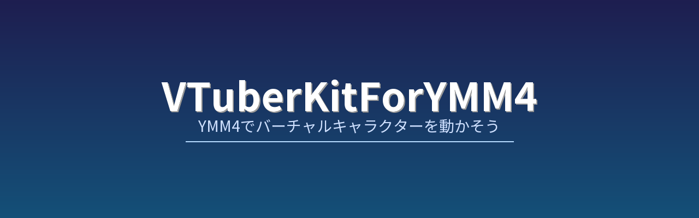

Live2DモデルをゆっくりMovieMaker4（YMM4）で立ち絵として使用するためのプラグインです。

<p align="center">
  
</p>

## Live2D Cubism SDK と公開時の注意

本リポジトリで公開しているのは、自作コードおよび自作アセットのみです。
Live2D Cubism SDK / Cubism Core 本体やその関連ファイルは含めていません。

このリポジトリを利用する場合は、各自で Live2D 公式サイトから Cubism SDK を取得し、規約に同意したうえでローカル環境にてビルドしてください。

### 動画を公開する場合

このリポジトリを使って作成した動画を公開する場合、Live2D Cubism SDK を使ったコンテンツの公開に該当する可能性があります。
個人または小規模事業者では通常は契約不要とされていますが、事業規模や利用形態によっては契約確認が必要になります。
※ 事業者規模は、個人・法人を問わず、対象コンテンツの売上ではなく、公開者自身の直近の年間売上高で判定されます。
詳細は Live2D 公式のライセンス説明を確認してください。

- SDK リリースライセンス
  https://www.live2d.com/sdk/license/
- 事業者区分の説明
  https://help.live2d.com/sdk/sdk_007/

### ソフトウェアを公開・再配布する場合

ローカルでビルドした成果物を、SDK を含む形でソフトウェアとして公開・再配布する場合は、別途ライセンス上の確認が必要です。
特に、複数のモデルやデータを扱えるツール類は「拡張性アプリケーション」に該当する可能性があります。
拡張性アプリケーションに該当する場合、個人・小規模事業者であっても審査・契約が必要です。

- 拡張性アプリケーション
  https://www.live2d.com/sdk/license/expandable/

なお、公開形態がライセンス上の「出版」に該当するかどうかの最終判断は Live2D 社によって行われます。
不明点がある場合は、Live2D 社へ直接確認してください。

問い合わせ経緯は [Issue #4](https://github.com/takoyakisoft/VTuberKitForYMM4/issues/4) を参照してください。

## 使用例

私のチャンネルでの使用例です。もしよければ見てみてください。
[▶ YouTubeチャンネル（takoyaki-soft）](https://www.youtube.com/@takoyaki-soft)

> [!NOTE]
> 動画内で使用しているプラグインは旧バージョンのため、現在のものとは仕様が異なります。

## インストール方法

> [!WARNING]
> 本リポジトリには Live2D Cubism SDK は含まれていません。
> 必ずご自身で Live2D 公式サイトから SDK を取得してください。
> 公開時の注意は「[Live2D Cubism SDK と公開時の注意](#live2d-cubism-sdk-と公開時の注意)」を参照してください。

ご自身で Live2D 公式から SDK をダウンロードし、ソースコードからビルドしていただく必要があります。
具体的な手順については、「[ソースからビルド](#ソースからビルド)」に記載します。

## 使い方

### モデルの準備

#### 1. 公式のサンプルモデルを使う場合

次のリンクから公式のサンプルモデルをダウンロードできます。
[Live2D サンプルデータ集](https://www.live2d.com/learn/sample/)

> [!NOTE]
> 個人利用なら商用利用可能とのことですが、モデルごとに利用規約を確認してから使用してください。

#### 2. ご自身で用意する場合

> [!NOTE]
> Live2D Cubism Editor の Free 版で試しています。

自作モデルを作る際の参考として、手描きで作成した Live2D サンプルモデルを [GitHub Releases](https://github.com/takoyakisoft/VTuberKitForYMM4/releases/tag/sample_model) にて **CC0（パブリックドメイン）** で配布しています。自由にお使いください。

- `takoyakisoft_runtime.zip`: YMM4 ですぐに読み込める書き出し済みモデルデータです。
- `takoyakisoft_source.zip`: Live2D Cubism Editor で開ける編集用の元データ（`.cmo3`, `.can3`）です。

自身で独自のモデルを作成する場合は、Live2D Cubism Editor で以下のファイルを用意します。

- モデルデータ: `.cmo3`
- アニメーションデータ: `.can3`
  （モーションがないとデフォルトの動作が不安定になる場合があります）

##### モデルデータの書き出し

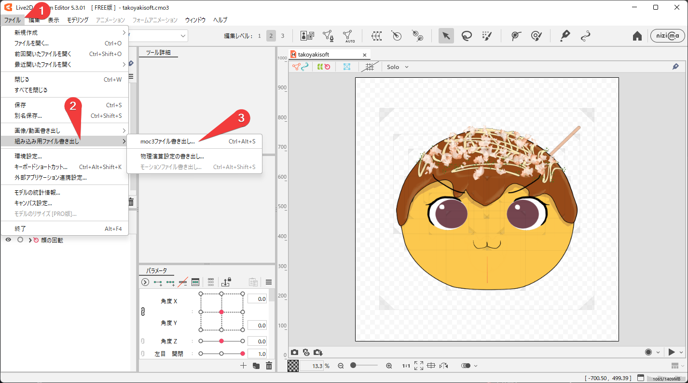
「ファイル」→「組込み用ファイル書き出し」→「moc3ファイル書き出し」をクリックします。

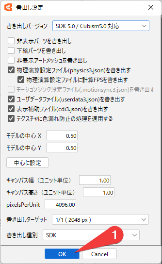
「OK」をクリックします。

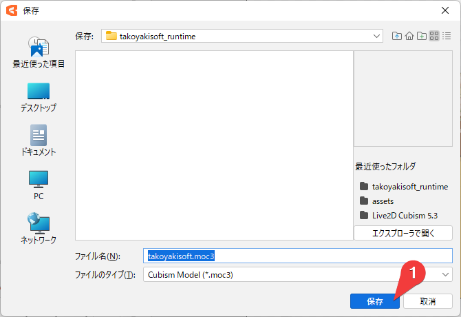

##### アニメーションデータの書き出し

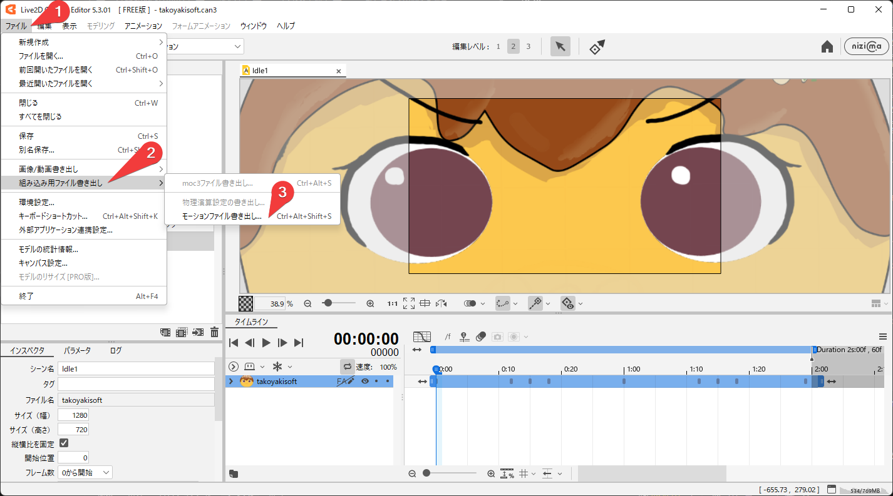
「ファイル」→「組込み用ファイル書き出し」→「アニメーションファイル書き出し」をクリックします。

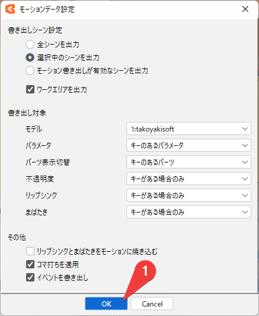
「OK」をクリックします。

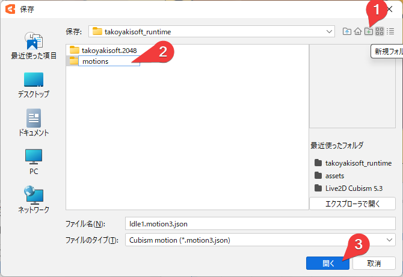
「新規フォルダ作成」をクリックし `motions` フォルダを作成します。
その中に「保存」します。

> [!WARNING]
> **Free 版で書き出す場合のアニメーション設定について**
> Live2D Cubism Editor の Free 版では、書き出し時にアニメーション（モーション）が `.model3.json` に自動的に紐付けられません。
> そのため、書き出し完了後、出力された `.model3.json` をメモ帳などのテキストエディタで開き、以下のように手動で `Motions` の項目を追記する必要があります。
>
> 追記例:
> ```json
> "FileReferences": {
>   "Moc": "takoyakisoft.moc3",
>   "Textures": [ ... ],
>   "Physics": "takoyakisoft.physics3.json",
>   "DisplayInfo": "takoyakisoft.cdi3.json",
>   // ↓ ここから追記                       ↑ このカンマも忘れないように
>   "Motions": {
>     "Idle": [
>       { "File": "motions/idle.motion3.json" }
>     ]
>   }
>   // ↑ ここまで
> },
> ```

### VTuberKitForYMM4での読み込み

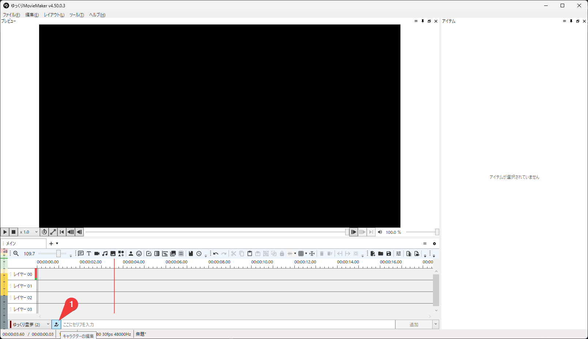
ここをクリックします。

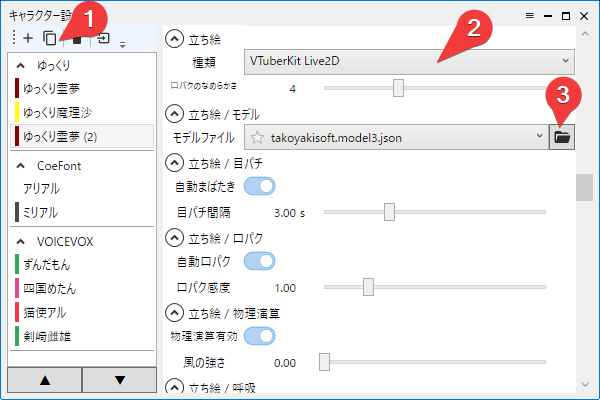

> [!CAUTION]
> キャラクター設定は必ず複製してください。このプラグインがなくなるときキャラクター設定も消えます！

「立ち絵」の「種類」を「VTuberKit Live2D」を選択します。
「モデルファイル」に用意したモデルデータ（`.model3.json`）を選択します。

> [!CAUTION]
> Live2D立ち絵の `拡大` は、できるだけこのプラグイン側の設定で調整してください。
> YMM4側の拡大率で大きく拡大すると、最終段で拡大縮小されるため画質が劣化しやすくなります。
> また、`回転` もターゲットポイントやヒットエリアの見た目と計算位置のずれにつながるため、このプラグイン側で行うのを推奨します。
> `移動X` `移動Y` の移動自体は問題ありません。

### 実際に動かす

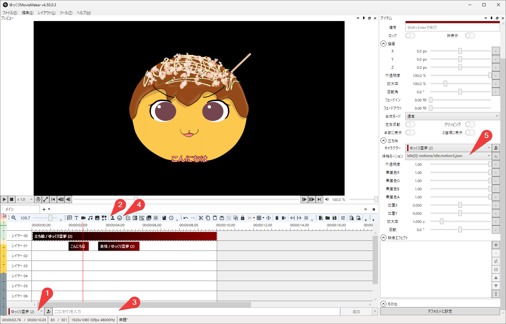
ここは YMM4 の説明なので、ざっくり説明します。
1 の先ほど作ったキャラクターを選択して、2 で立ち絵アイテムを最初のトラックに配置します。
3 と 4 で声と表情のアイテムを配置します。
5 では立ち絵アイテムに待機モーションを割り当てています。

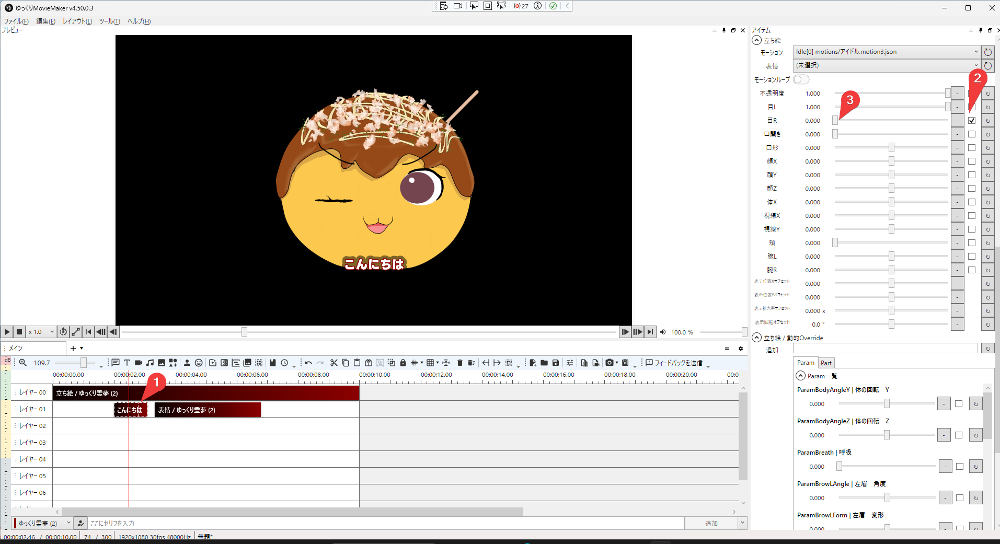
声と表情のアイテムの設定は共通です。
Live2D 自体に表情やモーションの機能があるらしいですが、待機モーション一つでも動いています。

### ターゲットポイントとヒットボックス

- `Live2Dターゲットポイント` と `Live2Dヒットボックス` の `X/Y` は、YMM4 の画面座標ではなく Live2D のモデル空間です。
- 図形の表示位置は、対象キャラクターの `位置X/Y` `拡大率` `回転` に追従します。
- その一方で、図形の `X/Y` 自体はモデル空間の値なので、YMM4 の画面座標を直接入力するものではありません。
- 立ち絵側の `リンクID` を空欄にすると、キャラクターごとに一意の ID を自動採番します。
- 図形側は対象キャラクターを明示選択するのを推奨します。キャラクターが 1 体だけ見つかる場合のみ自動補完されます。
- ターゲットポイントがある場合はそれを優先し、ない場合のみヒットボックスの反応を使用します。
- ヒットボックスは `キャラクターヒットエリア` を設定しないと判定されません。`model3.json` の `HitAreas` 名に合わせてください。
- ヒットボックスは Live2D が自動で物理演算してくれる機能ではありません。このプラグインでは、判定が `true` の間だけ矩形中心を drag 入力として使います。

### 拡大率について

- YMM4 側の `拡大率` は最終的な画面配置です。
- VTuberKit 側の `内部倍率` と `RT最大サイズ` は内部描画品質の設定です。
- 大きく拡大して使う場合は、YMM4 側の `拡大率` だけでなく、VTuberKit 側の `内部倍率` も調整してください。`拡大率` だけを上げると画質が劣化します。
- ターゲットポイントとヒットボックスの座標は Live2D モデル空間基準です。図形自体は画面上の位置や拡大率に追従しますが、入力値はモデル空間として扱われます。

## ソースからビルド

### 必要なもの

- **Visual Studio 2026**（C++ デスクトップ開発ワークロード導入済み）
- **YukkuriMovieMaker4**
- **Live2D Cubism SDK for Native** (v5-r.4.1)

### 手順

1. [Live2D 公式サイト](https://www.live2d.com/download/cubism-sdk/download-native/) から Cubism SDK for Native をダウンロードし、リポジトリルートに展開します。

```

VTuberKitForYMM4/
├── CubismSdkForNative/
├── VTuberKitForNative/
├── VTuberKitForYMM4/
└── ...

```

2. `Directory.Build.props.sample` を `Directory.Build.props` にコピーし、`YMM4DirPath` を自分の環境に合わせて編集します。

3. Visual Studio 2026 で `VTuberKitForYMM4.sln` を開き、`Release|x64` でビルドします。

4. ビルド後、自動的に YMM4 のプラグインフォルダにコピーされます。

**注意:** C++/CLI プロジェクト（`VTuberKitForNative`）を含むため、`dotnet build` 単体ではビルドできません。

## リリースについて

GitHub Actions で Cubism SDK を扱うとライセンス上の懸念があるため、ビルドはローカル環境で行ってください。

`Release|x64` ビルド後、`YMM4DirPath\user\plugin\VTuberKitForYMM4` に出力されたプラグイン一式を用いてローカルで動作確認できます。

SDK を含む形でソフトウェアを公開・再配布する場合は、事前に Live2D のライセンス条件を必ず確認してください。
特に、拡張性アプリケーションに該当する場合は審査・契約が必要です。

## 動作環境

- YukkuriMovieMaker4 v4.50.0.3
- Windows 11 (64bit)

## ライセンス

このソフトウェアは MIT ライセンスの下で公開されています。

### 使用ライブラリ

- **Live2D Cubism SDK for Native** (v5-r.4.1) — [Live2D Proprietary Software License](https://www.live2d.com/eula/live2d-proprietary-software-license-agreement_en.html)
- **YukkuriMovieMaker4** (v4.49.0.2)

### 謝辞

このプラグインは、以下のプロジェクト・ライブラリのおかげで実現できました。開発者の皆様に心より感謝いたします。

- [YukkuriMovieMaker4](https://manjubox.net/ymm4/) — 饅頭遣い様
- [Live2D Cubism SDK](https://www.live2d.com/) — Live2D Inc.

## READMEについて

このREADMEは、構成整理や表現の検討に GPT-5.4 を利用しています。
ただし、技術内容、ライセンス上の注意、手順説明は人の手で確認し、必要に応じて加筆修正しています。
